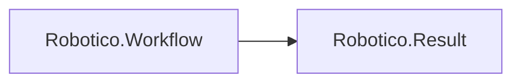

# Robotico.Workflow

[](https://dotnet.microsoft.com/download/dotnet/8.0)
[](https://dotnet.microsoft.com/download/dotnet/10.0)
[](https://github.com/robotico-dev/robotico-workflow-csharp/packages)

Long-running workflow with state machine, step persistence, and durability. Result-based. Depends on Robotico.Result. Separate from Robotico.Saga (compensation).

## Robotico dependencies



## Installation

```bash
dotnet add package Robotico.Workflow
```

## License

See repository license file.
