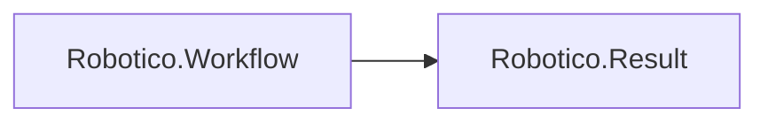

# Robotico.Workflow
[](https://dvalin.robotico.dev/robotico/robotico-workflow)


[](https://github.com/robotico-dev/robotico-workflow-csharp/actions/workflows/publish.yml)
[](https://dotnet.microsoft.com/download/dotnet/8.0)
[](https://dotnet.microsoft.com/download/dotnet/10.0)
[](https://github.com/robotico-dev/robotico-workflow-csharp/packages)

Long-running workflow with state machine, step persistence, and durability. Result-based. Depends on Robotico.Result. Separate from Robotico.Saga (compensation).

## Robotico dependencies



## Installation

```bash
dotnet add package Robotico.Workflow
```

## Quick start

Use `IWorkflowState<TState>` to represent the current state of a workflow instance. Persist it (e.g. via Robotico.Repository) for durability and resumability. See `docs/design.adoc` for workflow vs saga.

## Documentation

Design docs (AsciiDoc) are in the `docs/` folder:

- **Design** (`docs/design.adoc`) — Workflow vs saga, API contract, durability and resumability, related packages.
- **Index** (`docs/index.adoc`) — Quick links and how to build the docs.

To build HTML: `asciidoctor docs/index.adoc -o docs/index.html` and `asciidoctor docs/design.adoc -o docs/design.html`.

## Building and testing

```bash
dotnet restore
dotnet build -c Release
dotnet test -c Release --collect:"XPlat Code Coverage"
```

## Related packages

- **Robotico.Repository** — Persist workflow state for durability and resumability.
- **Robotico.Resilience** — Retry step execution or state transitions.
- **Robotico.Events** — Emit domain events when transitioning or completing.

## License

See repository license file.
